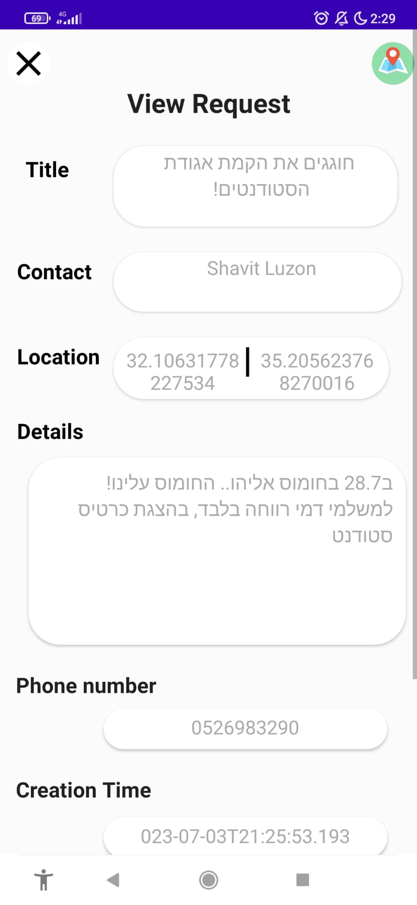

# Give And Take: Android Application
## Shared map-based, users events storage and management
For Ariel university students | staff that are smartphone users, who want to ask for help or give help to their peers: 

the Give and Take Android application is a sharing social application
that allows users to open and maintain requests, watch open requests of others, and to communicate to offer their help, with an option of filtering based on location, visualization and placing requests on a map, to see for instance who’s nearby.

Unlike traditional social/map apps sites such as WhatsApp or Google Maps, our product allows users to manage the requests on a targeted system to Ariel students only, enabling wide distribution and location filtering by combining requests management and a map.

## Features:

1) The system displays a map, by interacting with a map service

2) The application allows saving information of requests and events in the database

3) The system allows users to create requests

4) The application displays real convenient and clear to the user.  It will be easy to distinguish the different actions

5) The app allows an admin user to block users

6) The administrator is given the option to add an event with a special icon

7) The application offers a notification service for a new request/event, according to the user's preferences.

8) The app enables users to report other users

9) The system requires a university email to register users

10) Admins are able to remove user posts

11) The app enables communication between the users of the application 
    so that they can answer requests

12) The system allows user registration and login according to verified details, which will be saved in the system

13) A user is able to delete his request from the map

13) Managing the requests and viewing them on the map is reliable,
    all users at the same time will see the same map

14) The requests appears in the form of dedicated icons on the map that
    are visible to all users.
    
15) Search bar on map to navigate to requested location by address.

## Installation

Download the code from this repository.

If you want to run the Uploading Requests Server:
Open the main.py
pip install all needed packages you see
then run the code py main.py
or click Play from IDE

Then download the java code, 
open in Android studio and run it there
on emulator or on pyhsical device

APK version will be available soon to download directly Be'ezrat Hashem

## Usage

Open the app, register, verify your email and phone number as insturcted,
then login and let the magic begin.
Have fun helping and being an active part of this community!

## Contributing

Pull requests are welcome. For major changes, please open an issue first
to discuss what you would like to change.

Please make sure to update tests as appropriate.

## License

[MIT](https://choosealicense.com/licenses/mit/)
